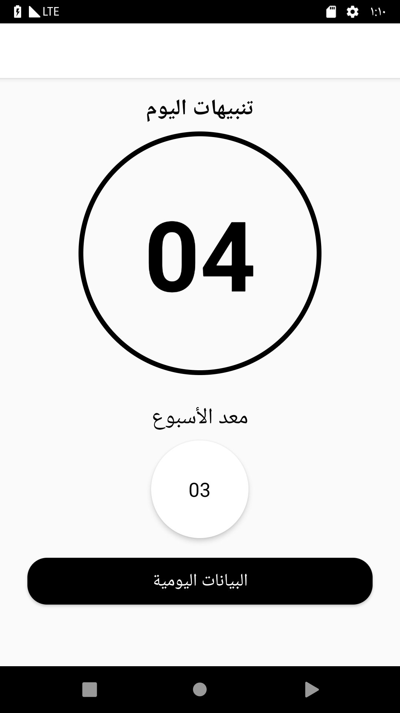
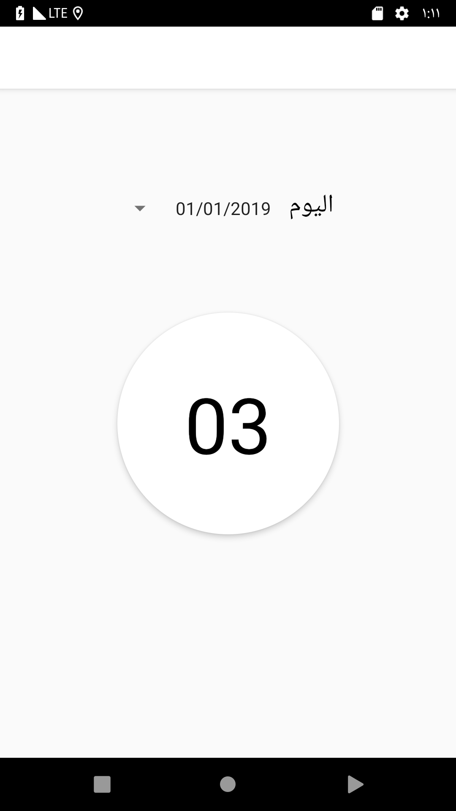
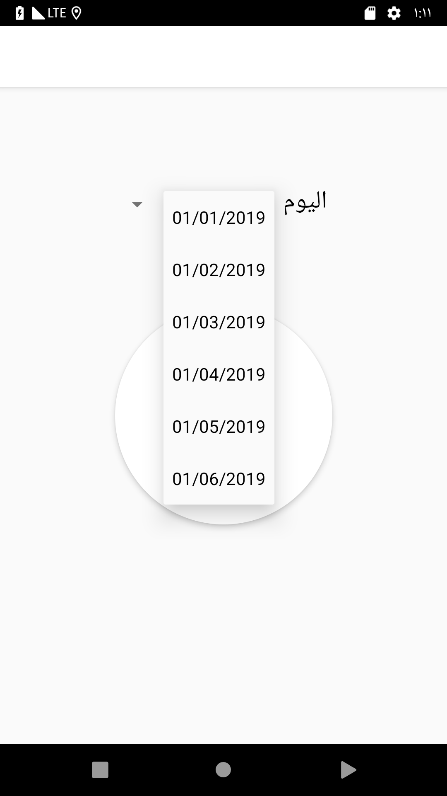

# نبذة عن المشروع

في الكثير من الأحيان نحتاج إلى عمل شئ مهم باستخدام الهواتف النقالة ولكن عند فتح قفل الهاتف تزدحم علينا التنبيهات ويضيع الوقت وننسى ما نريد فعله.

بالإضافة إلى استخدام الهاتف لوقت طويل دون الانتباه مما يؤثر على صحتنا العامة.

في هذا المشروع سنقوم بحل هذه المشكلة عن طريق توظيف المفاهيم التي تعرفنا عليها لتطوير تطبيق باسم "صحتك تهمنا".

التطبيق يقوم بتنبيه المستخدم عند استخدام الهاتف لأكثر من 25 دقيقة من فتح الشاشة ويتكرر التنبيه لكل 25 دقيقة، عن طريق إضافة تنبيه Notification على الجهاز مع رسالة تشجعه على أخذ استراحة و اقتراح بعض التمارين مثل الوقوف أو المشي.

# الهدف من هذا المشروع ؟
في الدروس الأخيرة تعلمت كيفية استخدام المفاهيم المتعلقة بمهام الخلفية لجعل تطبيق الطقس يقوم بتحديث البيانات تلقائيا في أوقات معينة. في هذا المشروع سوف تتدرب على هذه المهارات مع التركيز على مفاهيم مهام الخلفية مثل WorkManager و Notifications وغيرها.

# متطلبات المشروع 

يجب أن يحتوي المشروع على المزايا التالية:
* صفحة رئيسية تعرض كم مرة تم الوصول إلى الحد وتم تنبيه المستخدم اليوم.
* حفظ بيانات المستخدم اليومية باستخدام Room وعرضها في واجهة مختلفة. في هذه الواجهة يتم استخدام مكون يعرف بـ [Spinner](https://developer.android.com/guide/topics/ui/controls/spinner) يمكنك التعرف عليه وعلى كيفية استخدامه من خلال 
[الرابط](https://developer.android.com/guide/topics/ui/controls/spinner) 
* تنبيه المستخدم عندما يصل إلى الحد عن طريق إظهار تنبيه باستخدام مفهوم Notification و Notification channel.
* استخدام مفهوم WorkManager مع [Work constraints](https://developer.android.com/topic/libraries/architecture/workmanager/how-to/define-work#constraints) لجدولة المهام لتنبيه المستخدم

# الشاشة الرئيسية

# الشاشة الفرعية

